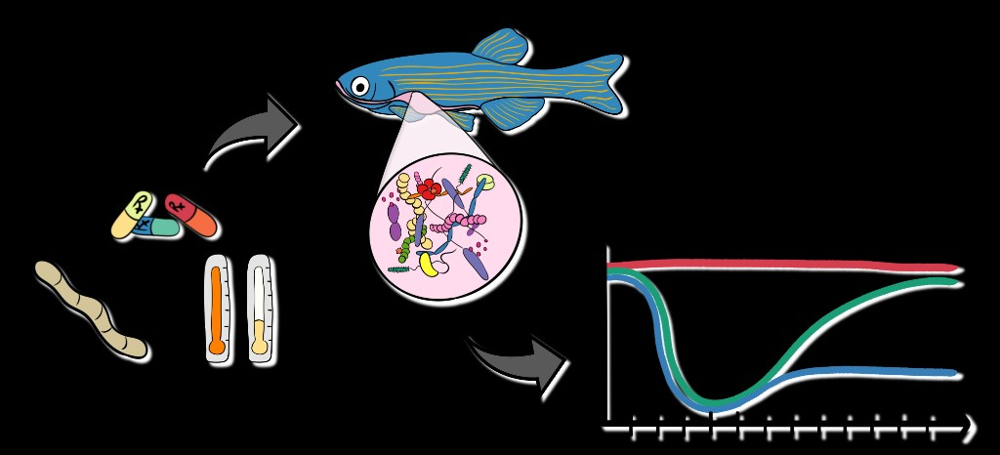
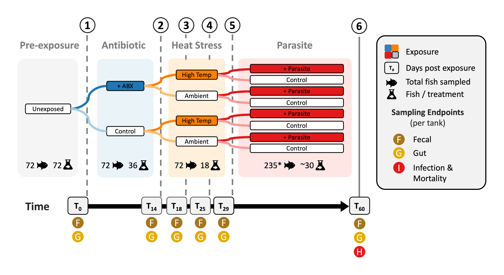

# Historical contingency in the zebrafish gut microbiome



*Conceptual overview — antibiotics, heat, and parasite stressors; gut microbiome; example response trajectories.*



*Main Figure 1 — sequential stressor design and sampling timeline (matches manuscript Fig 1).*

Analysis code and processed data for **Historical contingency shapes zebrafish host-microbiome responses to a subsequent biotic challenge** (Sieler et al., bioRxiv 2026).

## What this repository contains

Adult zebrafish (*Danio rerio*) experienced sequential antibiotics, heat, and parasite stressors over 60 days. This repo includes R analysis drivers, processed phyloseq and Salmon inputs, module-level results bundles, and supplementary tables/figures for the June 2026 submission build. Raw FASTQ files are on NCBI under BioProject [PRJNA1482558](https://www.ncbi.nlm.nih.gov/bioproject/PRJNA1482558) (public release 2027-09-01).

## Quick start

```r
# Prerequisites: R 4.5.1+, Git
# git clone https://github.com/sielerjm/zebrafish-stress-contingency-2026.git
# cd zebrafish-stress-contingency-2026
source("install_dependencies.R")   # once — see Software_SessionInfo CSV for versions
source("run_all.R")                # full pipeline (hours); or run modules individually
# Large DESeq2 checkpoints: https://doi.org/10.5281/zenodo.20941630 (see DATA.md)
```

See [QUICKSTART.md](QUICKSTART.md) for step-by-step instructions and [REPRODUCE.md](REPRODUCE.md) for module order and runtime notes.

## Repository map

| Folder | Contents |
|--------|----------|
| `Code/01__Analysis/` | Analysis drivers (`00__Overview.R` … `08__NeutralModel.R`) |
| `Code/02__Results/` | Display R Markdown (knit after drivers; load bundle RDS) |
| `Data/` | Processed inputs — phyloseq, Salmon counts, metadata ([DATA.md](DATA.md)) |
| `Results/` | Figures, tables, and bundle RDS per module |
| `Manuscript/` | Main-text figure exports and supplementary zips |

## Analysis modules

| Script | Results folder | Main-text figure |
|--------|----------------|------------------|
| `00__Overview.R` | `Results/00__AnalysisSetup/` | — |
| `01__Diversity.R` | `Results/01__Diversity/` | Fig 2B |
| `02__Composition.R` | `Results/02__Composition/` | Fig 2A, C, D |
| `03__DiffAbund.R` | `Results/03__DiffAbund/` | Fig 5 |
| `04__DiffGeneExp.R` | `Results/04__DiffGeneExp/` | Fig 3 |
| `05__Mort-Inf.R` | `Results/05__Mort-Inf/` | Fig 4 |
| `06__Taxon-DEG-Mort.R` | `Results/06__Taxon-DEG-Mort/` | Fig 6 |
| `07__FunctionalAnno.R` | `Results/07__FunctionalAnno/` | Supp |
| `08__NeutralModel.R` | `Results/08__NeutralModel/` | Supp |

Run from the repository root:

```bash
Rscript Code/01__Analysis/01__Diversity.R
```

## Data availability

| Resource | Location |
|----------|----------|
| Raw 16S + RNA-seq reads | [NCBI BioProject PRJNA1482558](https://www.ncbi.nlm.nih.gov/bioproject/PRJNA1482558) |
| Processed phyloseq / Salmon (this repo) | `Data/` — see [DATA.md](DATA.md) |
| DESeq2 checkpoint RDS (~215 MB) | [Zenodo 10.5281/zenodo.20941630](https://doi.org/10.5281/zenodo.20941630) — see [DATA.md](DATA.md) |
| Supplementary tables & figures | `Manuscript/Supplementary/` |

## License and citation

- **Preprint (manuscript PDF on bioRxiv):** CC-BY-NC 4.0 — author/funder copyright (select at upload).
- **This repository (code + processed data):** © 2026 Oregon State University — free for educational, research, and non-profit use under [LICENSE](LICENSE). Commercial use requires [OSU Office of Technology Transfer](https://oregonstate.technologypublisher.com/).
- **Cite:** [CITATION.cff](CITATION.cff) — update bioRxiv DOI after posting.

## Contact

Open a [GitHub Issue](https://github.com/sielerjm/zebrafish-stress-contingency-2026/issues) for questions about reproducing analyses.

**Michael J. Sieler Jr.** — Oregon State University
